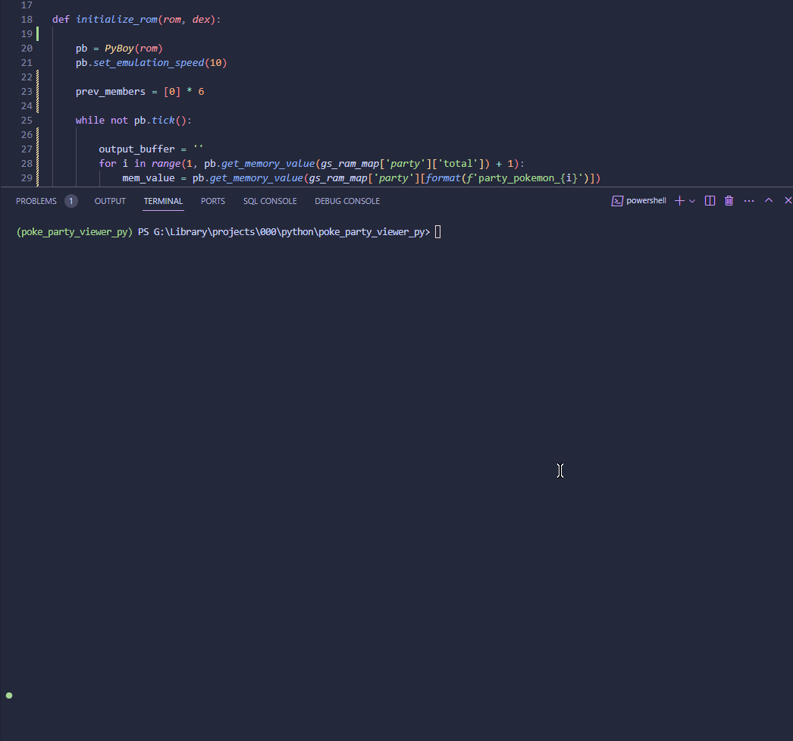

# poke_party_viewer_py
 
An experiment using PyBoy to view a players party in real time

## References
https://bulbapedia.bulbagarden.net/wiki/List_of_Pok%C3%A9mon_by_Johto_Pok%C3%A9dex_number
https://datacrystal.romhacking.net/wiki/Pok%C3%A9mon_Gold_and_Silver:RAM_map#Party_Pokemon
https://github.com/Baekalfen/PyBoy
